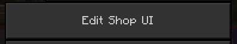

# Editing shop form

Click manage button

Click edit shop UI button

After that, you should see something like this:

After filling in the inputs, click submit:

When you open the main page of your shop, you should see this:

