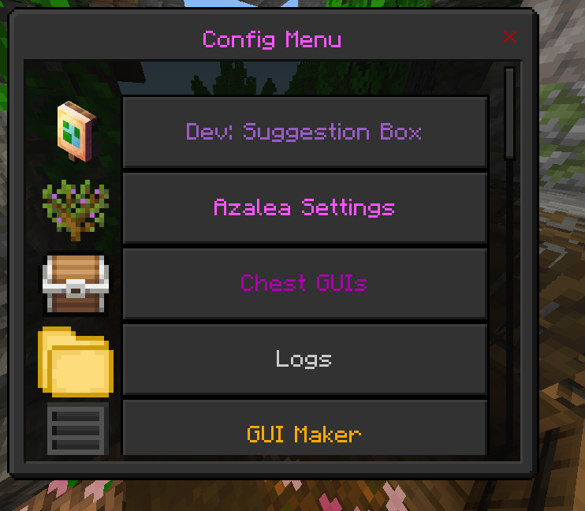
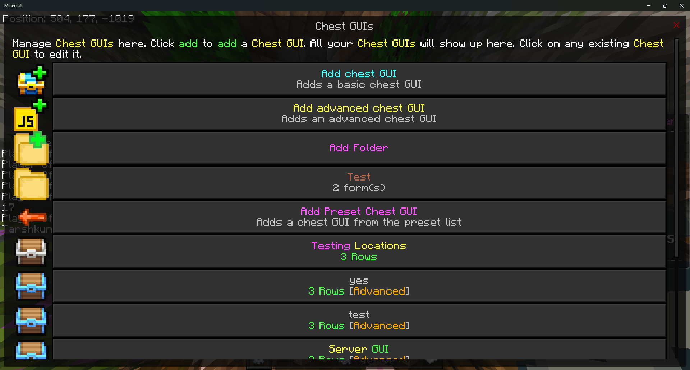
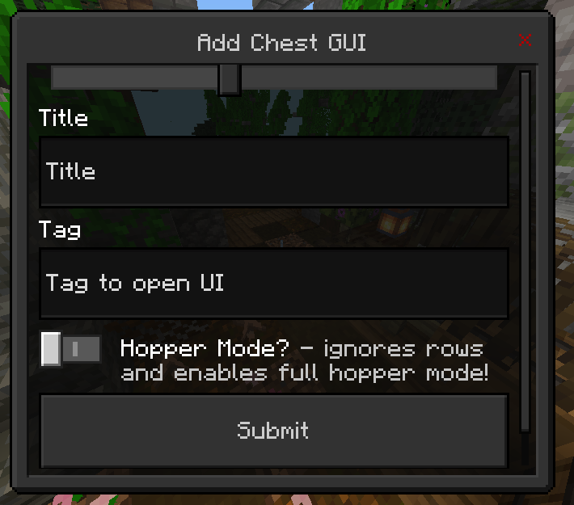

# Creating A Chest GUI

## 1. Open Admin Panel
> 

## 2. Click on the "Chest GUIs" button
> 

# 3. Click on the "Add chest GUI" button

> 

Type a title, and tag, and configure the rows or hopper mode if needed

Click "Submit"

Reopen your chest GUI editor and click on the GUI you just made. You should see "delete", "edit items", and "edit settings". Click on "edit items"