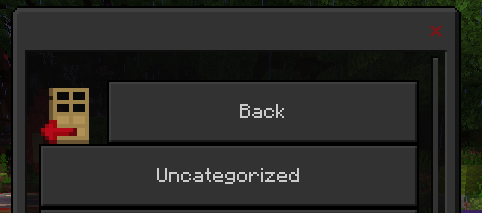
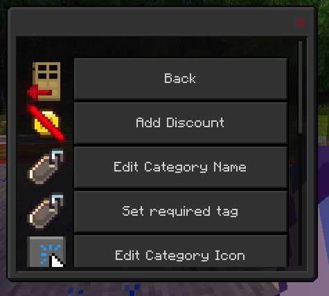
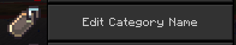
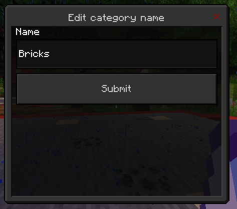
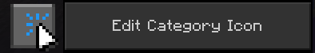
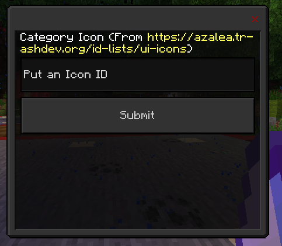
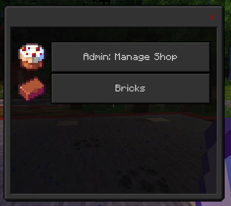

# Customizing Categories

Click the manage shop button

---

Click your category

---

You should see something like this:

---

## Editing Category Name

Click this button:

Type the new name you want and click submit

---

## Editing Category Icon

Click "Edit Category Icon"

Type any icon ID from [the icons list](/docs/lists/icons)

---

## Final Result

after you have done all of this, your shop should look something like this