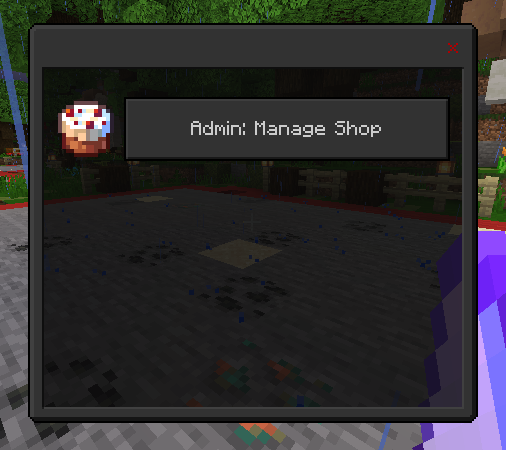
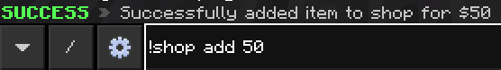
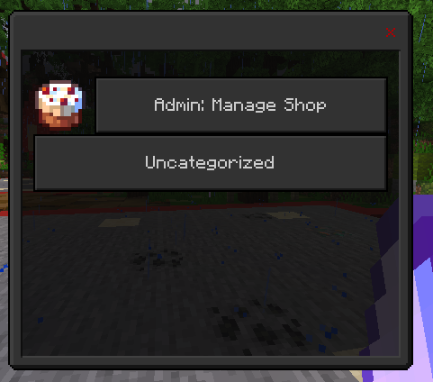
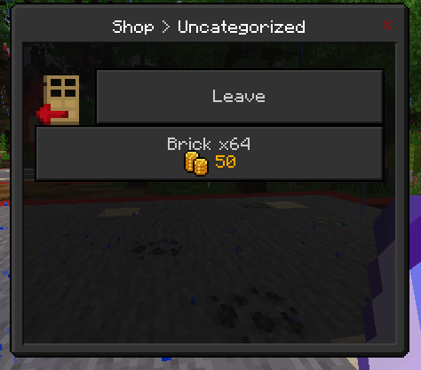

# Getting Started

Once you first open shop, you should see something like this:

To add items, you can do `!shop add <price>`. This will add the item you are currently holding in your hand.

If the command was successful, you should see something like this

---

When you open shop again, you should see a new category.

---

In that category, you should see something like this:

